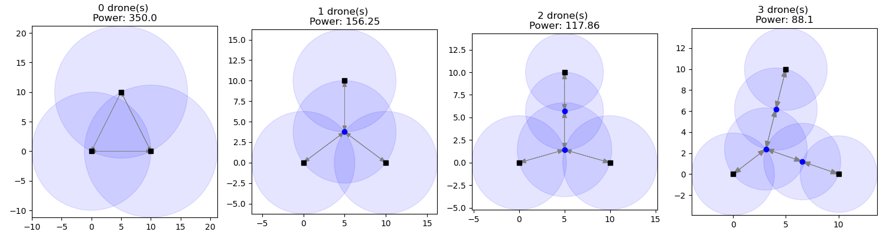

# Range Assignment Optimizer for Networks with Drones

_Dominik Krupke, 2023_

This repository contains experimental code for an exact solver for a range assignment problem with drones.
This problem was proposed by Aaron Becker.
The problem definition may differ slightly from the original problem statement.



## Problem Description

**Objective:**
Determine the optimal placement of drones and range assignments for both terminals and drones to ensure a strongly connected network among the terminals, with the goal of minimizing the overall power consumption.

**Input:**

1. **Terminals:** A predefined set of terminal nodes $T$ positioned at fixed locations within a 2D plane.
2. **Drones:** An allocation of $k$ drones $D$ available for strategic placement within the plane.

$A=T\cup D$ is the set of all agents.

**Constraints:**

1. **Strong Connectivity:** The network configuration must guarantee a directed path between any pair of terminal nodes, whether through direct connections or intermediated by drones.
2. **Range-based Connectivity:** One node is directly connected to another if their distance does not exceed the range of the originating node.
3. **Power Consumption Model:** A node's power consumption is directly proportional to the square of its transmission range.

**Optimization Metric:**
Minimize the collective power consumption, which is represented by the sum of the squared ranges of all terminals and drones in the network.

## Insights

The problem can be efficiently solved via a Second Order Cone Program, if the topology of the network is known.

## Solver

The current solver leverages numerous Big-M formulations to determine the network topology, offering ample room for enhancements.

### Model Description

The computational model is a Mixed Integer Second Order Cone Program (MISOCP), solvable by advanced solvers such as Gurobi.

**Variables:**

* $p_i=(x_i, y_i) \in \mathbb{R}^2$: Represents the position of drone or terminal $i$ where $i$ belongs to the set $A$. Positions are predetermined for terminals, denoted as $T$.
* $r_i \in \mathbb{R}$: Denotes the squared range (equivalent to power) associated with a terminal or drone $i$.
* $d_{ij} \in \mathbb{R}$: Indicates the squared distance between any pair of terminal or drone $i$ and $j$.
* $z_{ij} \in \{0, 1\}$: A binary variable, which is set to 1 if agent $i$ is directly connected to agent $j$ and 0 otherwise. If the topology is fixed, this variable can be eliminated, making the model a pure SOCP, which can be solved in polynomial time.

**Constraints:**

* For every $i, j$ belonging to $A$: $d_{ij} \geq squared\_dist(p_i, p_j)$. This constraint can be articulated using a Second Order Cone Constraint supplemented by certain auxiliary variables. Such constraints can be efficiently propagated.
* For every $i, j$ in $A$: $r_i \geq d_{ij} - (1-z_{ij})\times M$. Here, the power $r_i$ must be adequate to facilitate the connection if the decision is made to connect $i$ to $j$. The value of $M$ is a significantly large constant such that $r_i \geq d_{ij}$ whenever $z_{ij}=1$. This embodies the Big-M methodology and is the model's most expensive part. The maximum possible squared distance can cap $M$. Note that this only works with a $\geq$ as this represents a convex cone, however, the objective will enforce the $=$.
* For any subset $A'$ of $A$ where $T \cap A \neq \emptyset$ and $T \cap (A\setminus A') \neq \emptyset$: $\sum_{i \in A', j \in A\setminus A'} z_{ij} \geq 1$. This stipulation ascertains the establishment of a strongly connected network, integrated through callbacks.

**Objective Function:**

Minimize the aggregated power consumption across all nodes: $\sum_{i \in A} r_i$.

#### Enhancement Proposals

Several incremental enhancements have already been integrated, such as:

* Refining the big-M constants between terminals based on our knowledge of the maximum necessary range between them.
* Mandating that every terminal maintains at least one inbound and one outbound connection.
* Ensuring a minimum of $|T|$ edges when multiple terminals are present.

Potential avenues for further refinement include:

* Establishing minimum power requirements for individual agents.
* Determining more precise maximum power limits for individual agents, facilitating a reduction in the big-M constants.
* Introducing constraints to guarantee network connectivity.
* Exclusively leveraging the SOCP while independently implementing the branch and bound. This approach would necessitate a strategic iterative construction of the network, ensuring that each subnetwork serves as a lower bound for the comprehensive network.

## Installation

You can install the package via

```bash
pip install .
```

See the notebooks-folder for examples.